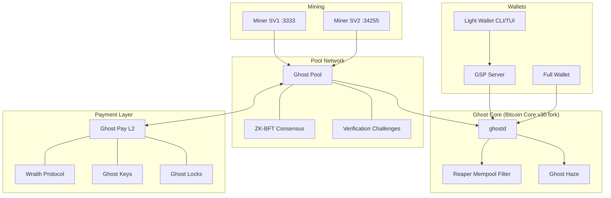

# Bitcoin Ghost

<div align="center">

```
 ▄▄▄▄    ██▓▄▄▄█████▓ ▄████▄   ▒█████   ██▓ ███▄    █      ▄████  ██░ ██  ▒█████    ██████ ▄▄▄█████▓
▓█████▄ ▓██▒▓  ██▒ ▓▒▒██▀ ▀█  ▒██▒  ██▒▓██▒ ██ ▀█   █     ██▒ ▀█▒▓██░ ██▒▒██▒  ██▒▒██    ▒ ▓  ██▒ ▓▒
▒██▒ ▄██▒██▒▒ ▓██░ ▒░▒▓█    ▄ ▒██░  ██▒▒██▒▓██  ▀█ ██▒   ▒██░▄▄▄░▒██▀▀██░▒██░  ██▒░ ▓██▄   ▒ ▓██░ ▒░
▒██░█▀  ░██░░ ▓██▓ ░ ▒▓▓▄ ▄██▒▒██   ██░░██░▓██▒  ▐▌██▒   ░▓█  ██▓░▓█ ░██ ▒██   ██░  ▒   ██▒░ ▓██▓ ░
░▓█  ▀█▓░██░  ▒██▒ ░ ▒ ▓███▀ ░░ ████▓▒░░██░▒██░   ▓██░   ░▒▓███▀▒░▓█▒░██▓░ ████▓▒░▒██████▒▒  ▒██▒ ░
░▒▓███▀▒░▓    ▒ ░░   ░ ░▒ ▒  ░░ ▒░▒░▒░ ░▓  ░ ▒░   ▒ ▒     ░▒   ▒  ▒ ░░▒░▒░ ▒░▒░▒░ ▒ ▒▓▒ ▒ ░  ▒ ░░
▒░▒   ░  ▒ ░    ░      ░  ▒     ░ ▒ ▒░  ▒ ░░ ░░   ░ ▒░     ░   ░  ▒ ░▒░ ░  ░ ▒ ▒░ ░ ░▒  ░ ░    ░
 ░    ░  ▒ ░  ░      ░        ░ ░ ░ ▒   ▒ ░   ░   ░ ░    ░ ░   ░  ░  ░░ ░░ ░ ░ ▒  ░  ░  ░    ░
 ░       ░           ░ ░          ░ ░   ░           ░          ░  ░  ░  ░    ░ ░        ░
      ░              ░
```

**Run a Bitcoin node. Get paid for it.**

[](https://github.com/bitcoin-ghost/ghost/actions)
[](LICENSE)
[](Cargo.toml)
[](https://www.rust-lang.org)

[Website](https://bitcoinghost.org) · [Whitepaper](https://bitcoinghost.org/whitepaper) · [Documentation](docs/) · [Getting Started](docs/protocols/GETTING_STARTED.md)

</div>

---

## Why Bitcoin Ghost?

Running a Bitcoin full node today is an act of charity. You donate bandwidth, storage, and compute to secure the network, and you get nothing in return. Ghost changes this by turning node operation into a compensated service — nodes prove their capabilities through cryptographic challenges and earn a share of mining revenue proportional to what they contribute.

Ghost is not an altcoin. It is a Bitcoin-native ecosystem: a fork of Bitcoin Core with enhanced mempool filtering, a decentralized mining pool with BFT consensus, an L2 payment layer with sub-second finality, and a privacy stack built on Silent Payments and CoinJoin. Every component speaks Bitcoin. Every satoshi stays on Bitcoin.

The result is a network where node operators are economically incentivized to run archival nodes, serve light wallets, mine honestly, and enforce sane mempool policy — not because they should, but because they are paid to.

---

## Architecture



<details>
<summary><strong>P2P Mesh Ports</strong></summary>

| Port | Purpose |
|------|---------|
| 3333 | Stratum V1 (native) |
| 34255 | Stratum V2 (SRI) |
| 8080 | REST API |
| 8555–8562 | P2P consensus mesh (shares, blocks, voting, health, discovery, elders, payouts) |
| 8800 | Ghost Pay L2 API |
| 8900 | GSP WebSocket |

</details>

---

## The 5-4-3-2-1 Share System

Ghost's killer feature is **proof-of-capability rewards**. Nodes earn shares in the mining reward pool based on what they verifiably provide to the network:

| Capability | Shares | What You Prove |
|:-----------|:------:|:---------------|
| **Archive Node** | +5 | Serve any historical block on demand |
| **Ghost Pay** | +4 | Process L2 instant payments |
| **Public Mining** | +3 | Accept miners on your Stratum port |
| **Reaper** | +2 | Run strict mempool filtering policy |
| **Elder** | +1 | Participated in MPC ceremony (first 101 nodes) |

**Maximum: 15 shares per node.** A node running all capabilities earns 15x the base reward of a minimal node.

Capabilities are not self-reported — they are continuously verified through cryptographic challenges issued by random peers every 5 minutes. Fake it and you fail. The gatekeeper: 95% uptime over a trailing 7-day window before any shares count.

---

## Quick Start

### Prerequisites

- **Rust** 1.75+ (stable)
- **Ghost Core** or Bitcoin Core 27.0+
- **SQLite** 3.35+
- **Linux / macOS** (Windows via WSL2)

### Build from Source

```bash
git clone https://github.com/bitcoin-ghost/ghost.git
cd ghost
git submodule update --init --recursive
cargo build --release
cargo test --workspace
```

### Run a Node (Earn Rewards)

```bash
# Start Ghost Core
./ghost-core/bin/ghostd -daemon

# Generate node identity
./target/release/ghost-cli key generate --output ~/.ghost/node.key

# Launch — connects to pool network, begins earning
./target/release/ghost-pool --config /etc/ghost/pool.toml

# Check status
./target/release/ghost-cli status
```

### Start Mining

Point any Stratum V1 miner at your node:

```
stratum+tcp://<your-node-ip>:3333
Worker: <your-bitcoin-address>.worker1
```

### Light Wallet

```bash
./target/release/ghost-light-wallet-cli init
./target/release/ghost-light-wallet-cli receive    # Silent Payment address
./target/release/ghost-light-wallet-cli balance --refresh
./target/release/ghost-light-wallet-cli send <address> <amount_sats>
```

### Docker

```bash
cd docker && cp .env.example .env
# Edit .env with your configuration
docker-compose up -d

# With monitoring (Prometheus + Grafana)
docker-compose --profile monitoring up -d
```

---

## Features

<details>
<summary><strong>Mining & Consensus</strong></summary>

- **ZK-BFT Consensus** — Zero-knowledge proofs replace trust. Validators verify proofs, never re-execute.
- **Native Stratum V1** on port 3333 — miners connect directly, no translator needed.
- **Stratum V2** via SRI pool on port 34255 for advanced mining setups.
- **Variable Difficulty** — automatic difficulty adjustment targeting 4 shares/minute per miner.
- **MPC Ceremony** — distributed key generation for the first 101 elder nodes.
- **No single point of failure** — fully distributed pool with Byzantine fault tolerance.

</details>

<details>
<summary><strong>Privacy</strong></summary>

- **Ghost Keys** (BIP-352) — Silent Payments. Share one address, receive unlimited payments. No address reuse, no sender-recipient linkage.
- **Wraith Protocol** — Two-phase CoinJoin mixing that breaks the transaction graph.
- **Ghost Shroud** — Random relay delay (0–5s) prevents transaction origin timing analysis.
- **Ghost Haze** — Field-stripped blocks for enhanced on-chain privacy.
- **Off-chain transactions** — L2 payments never touch the mempool.

</details>

<details>
<summary><strong>Payments</strong></summary>

- **Ghost Pay L2** — Off-chain payments with sub-second finality and periodic L1 settlement.
- **Ghost Locks** — P2TR outputs with timelocked recovery. Your funds are always recoverable, even if you lose access temporarily.
- **Ghost Labels** — Privacy-preserving payment metadata.
- **Light Wallet** — CLI and TUI clients backed by GSP (Ghost Service Provider) using BIP-157/158 compact block filters.

</details>

<details>
<summary><strong>Mempool Policy (BUDS)</strong></summary>

The **Bitcoin Use-case Differentiation System** classifies transactions into tiers:

| Tier | Category | Examples |
|------|----------|----------|
| **T0** | Core Financial | Standard payments, consolidations |
| **T1** | Extended Financial | Multisig, timelocks, HTLCs, Lightning |
| **T2** | Data Anchoring | Small OP_RETURN (<80 bytes), commitments |
| **T3** | Heavy Data | Inscriptions, large witness, stamps |

Policy profiles: `bitcoin_pure` (T0+T1), `permissive` (T0+T1+T2, default), `full_open` (all tiers).

</details>

---

## Documentation

### Getting Started

| Document | Description |
|----------|-------------|
| [Getting Started Guide](docs/protocols/GETTING_STARTED.md) | Step-by-step setup for new operators |
| [Wallet Overview](docs/wallets/README.md) | Choose the right wallet |
| [Technical Manual](docs/SPECIFICATION.md) | Full protocol specification |

### Protocols

| Document | Description |
|----------|-------------|
| [Node Capabilities](docs/protocols/NODE_CAPABILITIES.md) | 5-4-3-2-1 verification system |
| [Consensus](docs/protocols/CONSENSUS.md) | ZK-BFT consensus details |
| [Ghost Keys](docs/protocols/GHOST_KEYS.md) | Silent Payment implementation |
| [Ghost Locks](docs/protocols/GHOST_LOCKS.md) | Timelocked recovery |
| [Ghost Pay](docs/protocols/GHOST_PAY.md) | L2 payment network |
| [Wraith Protocol](docs/protocols/WRAITH_PROTOCOL.md) | CoinJoin mixing |
| [Ghost Shroud](docs/protocols/GHOST_SHROUD.md) | Relay origin protection |
| [BUDS Policy](docs/protocols/BUDS_POLICY.md) | Transaction classification |
| [MPC Ceremony](docs/protocols/MPC_CEREMONY.md) | Distributed key generation |

### Operations

| Document | Description |
|----------|-------------|
| [Deployment Runbook](docs/DEPLOYMENT_RUNBOOK.md) | Production deployment guide |
| [API Endpoints](docs/API_ENDPOINTS.md) | HTTP API reference |
| [RPC Commands](docs/RPC_COMMANDS.md) | Full RPC documentation |
| [Troubleshooting](docs/TROUBLESHOOTING.md) | Common issues and solutions |
| [Key Management](docs/KEY_MANAGEMENT.md) | Key rotation and security |

---

## Security

- **14 rounds** of comprehensive security auditing
- **Zero critical vulnerabilities** in release
- **Continuous fuzzing** via cargo-fuzz
- **Dependency auditing** via cargo-audit in CI
- Encrypted database fields, rate-limited APIs, Noise-encrypted P2P

Report vulnerabilities to: **security@bitcoinghost.org**

---

## Development

```bash
# Build
cargo build --release

# Test
cargo test --workspace              # Full suite
cargo test -p ghost-consensus       # Single crate
cargo test --test '*'               # Integration tests

# Code quality
cargo fmt --all
cargo clippy --workspace -- -D warnings
cargo audit
```

See [CONTRIBUTING.md](CONTRIBUTING.md) for guidelines on submitting pull requests.

---

## Acknowledgments

Bitcoin Ghost is built on the shoulders of extraordinary open-source work. We are grateful to:

**Bitcoin Core** — The foundation of everything. Ghost Core is a fork of [Bitcoin Core](https://github.com/bitcoin/bitcoin) v30, and the decades of careful engineering by its contributors make this project possible.

**Stratum V2 / SRI** — The [Stratum Reference Implementation](https://github.com/stratum-mining/stratum) team built the modern mining protocol that Ghost's pool infrastructure extends. Their work on decentralizing template selection is directly aligned with Ghost's mission.

**BIP Authors** — Ghost implements or builds upon the work of many Bitcoin Improvement Proposals:
- **BIP-352** (Silent Payments) by Josie Baker and Ruben Somsen — the core of Ghost Keys
- **BIP-340/341** (Schnorr/Taproot) by Pieter Wuille, Jonas Nick, and Tim Ruffing — used throughout for signatures and script paths
- **BIP-320** (Version Rolling) by BFGMiner/Timo Hanke — enables efficient mining hardware support
- **BIP-141** (Segregated Witness) — foundational to modern transaction handling
- **BIP-157/158** (Compact Block Filters) by Olaoluwa Osuntokun, Alex Akselrod, and Jim Posen — powers Ghost's light wallet privacy model
- **BIP-32/39/86** — HD wallets, mnemonics, and Taproot derivation paths

**Rust Bitcoin Ecosystem** — The [`rust-bitcoin`](https://github.com/rust-bitcoin/rust-bitcoin) and [`rust-secp256k1`](https://github.com/rust-bitcoin/rust-secp256k1) libraries provide the cryptographic and data structure primitives that Ghost is built with. The quality of these libraries is remarkable.

**Bellman / bellperson** — Ghost's ZK-BFT consensus uses [bellperson](https://github.com/filecoin-project/bellperson) (a fork of bellman) for Groth16 proof generation. Thanks to the Zcash and Filecoin teams for this work.

**Noise Protocol Framework** — The [snow](https://github.com/mcginty/snow) crate provides the encrypted P2P transport that secures Ghost's mesh network.

**The broader Rust and open-source communities** — Tokio, Axum, ZeroMQ, SQLite, and the countless other projects that make building reliable systems possible.

---

## License

[MIT License](LICENSE)

---

<div align="center">

**Bitcoin Ghost** — *Making node operation profitable, mining decentralized, and payments private.*

[Website](https://bitcoinghost.org) · [GitHub](https://github.com/bitcoin-ghost) · [Documentation](docs/)

</div>
